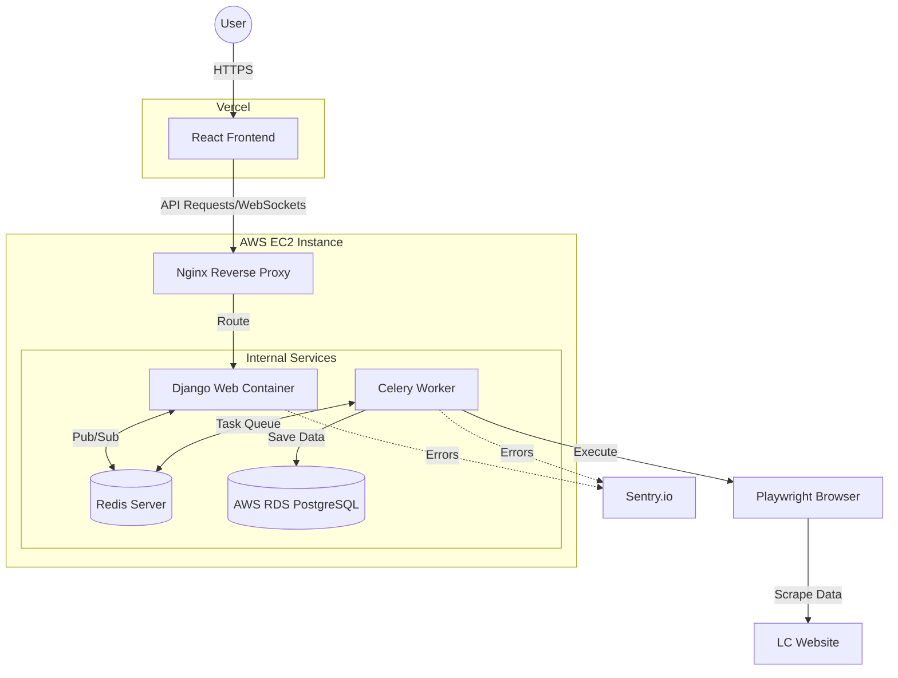

# 🍕 Little Caesars Pizza Tracker

### Frontend


### Backend & Data


### DevOps & Infrastructure


A full-stack web application that utilizes headless browser automation to scrape, store, and filter menu items, prices, and nutritional data from Little Caesars locations based on user-provided zip codes.

**[🚀 Try the Live Application Here](https://pizzascanner.org/)**

---

## 📸 Previews
  | 

## 💡 The Inspiration
I originally conceived this project to solve a personal frustration. As a budget-conscious student, I would manually check different Little Caesars locations to find the best prices. However, the official website's UI requires repetitive zip-code entries and frequently resets user sessions, making comparisons incredibly tedious. 

When I searched for an existing tool, I realized no tool existed that could track live, dynamic pricing across different store locations. 

I decided to build my own solution. What started as an idea to automate a repetitive manual task evolved into this full-stack, distributed web application designed to make fast, session-cached price comparisons between multiple Little Caesars restaurants located within the user's entered zip code.

## ✨ Features
* **Automated Data Extraction:** Built with Python and Playwright to navigate complex dynamic UIs and extract live pricing, calorie, item name, and location data.
* **Interactive Dashboard:** A mobile-responsive React frontend featuring client-side pagination and real-time filtering/sorting by item name, maximum price, and maximum calories.
* **Containerized Architecture:** Fully dockerized Django REST Framework backend to ensure consistent dependency management (like Linux browser binaries for Playwright) across environments.

## ☁️ Deployment Architecture
* **Frontend Hosting:** Deployed globally via Vercel for fast edge content delivery.
* **Backend Server:** Hosted on an Amazon Web Services (AWS) EC2 instance running Ubuntu Linux.
* **Asynchronous Task Queue:** 
   * **Celery:** Decouples heavy Playwright scraping tasks from the web server, allowing for non-blocking execution in the background.
   * **Redis:** Serves as the primary message broker for Celery tasks and the backend layer for Django Channels (WebSockets).
* **Real-Time Communication:** Django Channels provides WebSocket support to stream live scraping progress back to the frontend without page refreshes.
* **CI/CD Pipeline:** Fully automated zero-downtime deployment pipeline built with GitHub Actions, utilizing secure SSH key injections to trigger live Docker container rebuilds on AWS upon every code push.
* **Containerization:** The Django application, Daphne ASGI server, and Playwright Chromium binaries are fully containerized using Docker.
* **Proxy & Security:** Nginx is used as a reverse proxy to handle incoming requests, enforce HTTPS, and manage CORS headers between the Vercel frontend and AWS backend.
* **Memory Management:** Configured with a 4GB SSD Swap file to prevent Linux Out-Of-Memory (OOM) errors during heavy browser automation tasks.


## System Architecture


## 🔌 API Reference
The backend serves data to the frontend via a Django REST framework API.

| Endpoint | Method | Description |
|---|---|---|
| `/` | `POST` | Triggers the Playwright script to scrape a given zip code. |
| `/stores/` | `GET` | Retrieves the paginated list of saved menu items. |
| `/api/check_scrape_status/` | `GET` | Checks user IP to count the number of times they successfully scraped a zip-code. |
| `/api/db_version/` | `GET` | Retrieves the last scraped element to check changes in the database. |

## 🔍 Monitoring & Observability
This application uses **Sentry** to provide real-time error tracking and performance monitoring. It also uses Flower for task queue oversight

* **Automated Error Reporting:** All crashes (both in the Django web server and background Celery tasks) are automatically captured, including the full stack trace and the state of your local variables at the time of the crash.
* **Transaction Tracing:** We track the full lifecycle of a request, from the user's initial HTTP POST to the background Celery task execution, allowing for bottleneck identification.
* **Alerting:** Real-time notifications are configured for critical errors to ensure rapid incident response.
* **Worker Queue monitoring** All queue tasks are trackable in real time via flower

**Local Development:**
To test monitoring locally, ensure your `SENTRY_DSN` is set in your `.env` file. You can trigger a test error by navigating to your internal debug route (e.g., `/debug-sentry/`) to ensure logs are flowing to the dashboard.

## 💻 Tech Stack
* **Frontend:** React, Vite, Tailwind CSS
* **Backend:** Python, Django, Playwright, PostgreSQL, AWS RDS, Redis, Celery
* **Infrastructure & Deployment:** Docker, GitHub Actions (CI/CD), Daphne, AWS EC2, Vercel, Nginx, Sentry, Flower

---

## 🚧 Known Limitations
- Scraping is rate-limited to prevent overloading the LC website

## ⚙️ Local Installation & Setup

### Prerequisites
* Docker and Docker Compose installed on your machine.
* Node.js and npm (for local frontend development).
* Make sure you use chromium as it is the most stable browser for this project. Headless=True if running on a server
* Ensure all modules are in correct versions and are installed in your environment

### Backend Setup
1. Clone the repository:
```bash
git clone https://github.com/Shady1523/Caesar-web-app.git
```

2. Navigate to the backend directory and create a .env file with this exact information:
   ```Code Snippet
   DEBUG=True
   ALLOWED_HOSTS=localhost,127.0.0.1
   CORS_ALLOWED_ORIGINS=http://localhost:5173
   CSRF_TRUSTED_ORIGINS=http://localhost:5173
   SECRET_KEY=[your_generated_django_secret_key_here]
   DATABASE_URL=[your_postgres_database_url_here]
   CELERY_BROKER_URL=redis://redis:6379/0
   ```

3. Build and run the Docker containers:
   ```Bash
   docker compose up --build
   ```

### Frontend Setup
1. Navigate to the frontend directory:
   ```Bash
   cd frontend
   ```

2. Install dependencies:
   ```Bash
   npm install
   ```

3. Create a .env file for your API URL:
   ```Code Snippet
   VITE_API_BASE_URL=http://localhost:8000/
   ```

4. Start the development server:
   ```Bash
   npm run dev
   ```

### Useful Commands
   1. Check worker logs:
   ```Bash
   -”docker compose logs worker”
   ```

   2. Check web logs:
   ```Bash
   -“docker compose logs web”
   ```

   3. Restarting The Environment:
      ```Bash
      -sudo docker compose down
      -sudo docker volume prune  # Removes stale cache/connections
      -sudo docker compose up -d
      ```
   4. Checking Redis Health:
      ```Bash
      -sudo docker exec -it <container_name_or_id> redis-cli ping
      ```
      Expected output: PONG

   5. Checking Flower Dashboard: go to http://localhost:5555